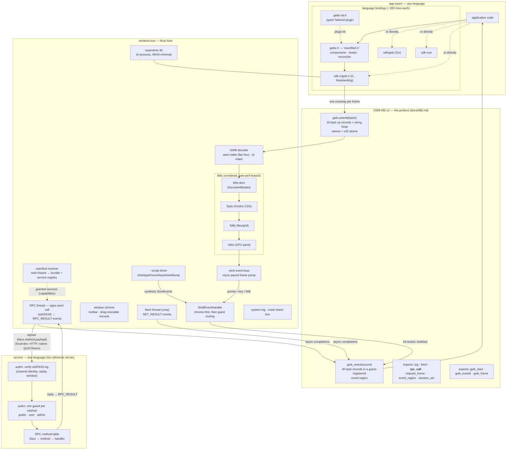

# WASIBrowser

**A wasm-first browser platform — research repo.** (Formerly GoWebBrowser —
renamed because the point is *every* language, not one. The `gwb`/`GWB1`
prefixes live on as the ABI's wire names.)

Any language compiles to WebAssembly and drives the page through a fast binary
DOM ABI. **Zero JavaScript anywhere** — no script engine, no JS DOM bindings,
none of the per-call / string-marshaling / wrapper-object overhead that every
JS-hosted framework ultimately pays. This is the "true Java ideal" the applet
era never reached: the browser as a language-neutral runtime where *your*
language is a first-class citizen of the page.

The rendering engine (Blitz: Stylo styling + Taffy layout + Vello GPU paint,
no JS) is deliberately a **commodity behind a seam**. The research artifact is
the **ABI** (`docs/ABI.md`) and the layers communities can build on top of it.

---

## Architecture (v2 — single process)

One process, no pipes, no IPC: a guest→DOM write is a function call into the
renderer's address space. Writes travel as batched binary ops; everything
host→guest is a fixed-size event record; reads are frame-accurate
*observations*, never synchronous interrogation.



### Why this shape

- **In-process wasm** (wasmtime lives inside the renderer): the write path is
  `memcpy + decode`, measured at **~29 ns/op** — about 6× cheaper per
  operation than Chromium's JS↔DOM binding layer, and it's *one* boundary
  crossing per batch instead of one per call.
- **The engine is swappable.** Everything engine-specific sits behind the
  decoder's `DocumentMutator` calls. Blitz was *yoinked*, not built; if a
  better no-JS engine appears, the ABI (and every SDK above it) survives.
- **The Go spine** (`protocol/`, `engine/`, `host/` — wazero) predates v2 and
  is kept as the reference host + spec tests for the wire format.

---

## The API interconnect (GWB ABI v1)

The contract is small enough to hold in your head, and that is the point —
it's what makes new language bindings a weekend project, not a platform team.

**Writes — `gwb.submit(ptr, len)`.** A batch is a `"GWB1"` header + N fixed
16-byte op records + a string heap. The op set covers the whole DOM surface:
create element/text, set/remove attr & style, text, append/insert/replace/
remove, inner-html, `Listen`/`Unlisten`, `Observe`, `Focus`, `DefineAtom`.
Ops are validated and atom-resolved **during the call**; the buffer is
reusable on return. The ABI law: batches submitted while an event is being
dispatched are applied **after** the dispatch completes (mutating mid-dispatch
invalidates the engine's node chains — learned the hard way).

**Atoms — the string killer.** Tag/attr/style names travel as `u32` atoms.
0–1023 are well-known (elements 1–88 cover *every* renderable HTML tag; attrs
from 100; style props from 200); 1024+ are guest-defined once via `DefineAtom`
and reused forever. Common DOM traffic carries **zero string bytes**; values
are inline UTF-8 in the heap.

**Node identity.** Guest-allocated dense `u32` ids; id 1 is the mount root —
the only host node a guest can address. The host keeps a flat
`guest id → engine node` table. Guests own `#mount` and nothing else; there is
no `document`, no global scripting surface.

**Events — `gwb_events(count)`.** The host writes 40-byte records (kind,
flags, target, listener, timestamp, 16-byte kind-specific payload, optional
trailing string) into a buffer the guest registered once. The full browser
interaction surface is forwarded: pointer down/up/move/cancel, click,
dblclick, contextmenu, enter/leave (hover), wheel, key down/up, text input,
input, focus/blur, scroll — plus window-level `window_resize`,
`theme_change`, and **`page_load`** (delivered exactly once, right after the
initial batches apply — the "document loaded" moment). `PREVENTABLE` events
honor guest return flags for `preventDefault`/`stopPropagation`.

**Reads — observations, never round-trips.** `Observe(id)` subscribes to
frame-accurate layout rects delivered as events. A sync read across a process
or even a call boundary is a latency lie; the ABI simply doesn't have one.

**Async — the host owns the event loop.** `gwb.fetch(url)` returns a request
id; completion arrives later as a `NET_RESULT` event (status + body). A
freestanding wasm guest has no sockets and no threads — and doesn't need them.
The same pattern carries **RPC**: `gwb.rpc_call(service, iface, method, payload)`
returns a `req_id` and the reply lands as an `RPC_RESULT` event — the host
signs, routes, and verifies the call so the guest stays sandboxed (see the
interconnect section).

**Frames.** `request_frame` → one `gwb_frame(dt)` callback, paced by the
vsync redraw stream (a naive poll-loop self-feed spins at 0 ms; don't).

---

## "Reactified C" — the community-language thesis

The research question: *if the DOM boundary is cheap and language-neutral,
can any language community build its own first-class web idiom on top?* We
answered it with the least ergonomic language we had: **freestanding C**
(no libc, 16 KB of low-level binding).

`sdk-c/gwbc.h` — one header, no build step beyond clang — turns the C
preprocessor into a component model:

```c
#include "gwbc.h"
#include "gwbc-tw.h"   /* optional plugin: typed Tailwind + Preflight */

typedef struct { const char *title; } CounterProps;

component(Counter, props, CounterProps) {
    stateI32(count, 0);

    event(increment) {
        logf("[counter] %d -> %d", count, count + 1);
        set(count, count + 1);
    }
    eventKey(keys, k) {                      /* typed browser-event payloads */
        if (strEq(k.key, "Enter")) set(count, 0);
    }

    return main(
        class(U(twP(6), TwFlex, TwFlexCol, twGap(3))),
        h1(class(U(twTextSize(TwText2xl), TwFontBold)), props.title),
        p(text("Count: %d", count)),
        button(
            onClick(increment), onKeyDown(keys),
            class(U(twBg(TwSlate, 900), TwTextWhite, twPx(4), twPy(2),
                    twRounded(TwRoundedXl), TwTransition, Hover(BgSlate700))),
            "Increment"
        )
    );
}

app(Counter, { .title = "Hello from C" });
```

What that header actually delivers (all verified by scripted golden tests):

- **Components & props** — plain functions + compound literals; children as
  props; context (`context`/`provider`/`useContext`) without prop drilling.
- **Hooks** — `stateI32/Str/Bool/Enum/Struct`, `previousI32`, `useEffect`
  (after-commit, keyed, deps fingerprints, cleanups), `useQuery` with
  **stale-while-revalidate** over `gwb.fetch`, **`useRpc`/`gwbc_rpc`**
  (authenticated host-mediated RPC — see the interconnect section below),
  `memoI32/Str`, atoms (`useAtom`/`setAtom` shared state), `keyedId` refs, and
  **`renderArr`/`renderNew`** per-render arena allocation (growing, no `malloc`).
- **An identity reconciler** — `keyed()` / auto-keyed `mapKeyed` rows reuse
  host nodes across full re-renders, so a focused `<input>` keeps its caret
  through unrelated updates. No fiber, no diffing — identity only, and it's
  enough.
- **The full event surface** — `onClick/onDblClick/onContextMenu/onKeyDown/
  onFocus/onWheel/onHover(...)/onScroll` plus window-level
  `onLoad/onWindowResize/onThemeChange`, with typed payload views
  (`eventKey`, `eventPointer`, `eventWheel`, `eventResize`).
- **Every renderable HTML tag** (88 of them, lowercase like JSX host
  elements) and **utility-class styling** — `U(...)` tokens compile to
  deduplicated classes in one generated `<style>` element, `Hover()` variants
  included. `gwbc-tw.h` adds a typed Tailwind layer: the full 22-hue × 11-shade
  palette, spacing/typography/shadow scales as enums and functions, and a
  zero-specificity Preflight.

The flagship demo, `examples/task-dashboard-c` (~66 KB of wasm), is a
10-component dashboard: semantic HTML (`dl`/`dt`/`dd`, `form`/`label`/
`output`, `nav`, `mark`, `kbd`), keyed filtered lists, payload-bound handlers,
remote data with refetch, hover highlighting, Enter-to-submit, wheel-adjusted
priority, and a live debug panel — in C, with business logic in a separate
pure-C translation unit.

**The point is not that people should write webpages in C.** The point is
that if *C* can have a pleasant, React-shaped authoring layer in one header,
then every language community — OCaml, Zig, Swift, Kotlin, Lua — can build
their own native idiom directly on the ABI, with their own type system doing
the safety work, and pay no JS tax on the way to the screen. The Go SDK
(`sdk/gwb`) and Rust SDK (`sdk-rust`) prove the polyglot claim at the wire
level: all three bindings emit **byte-identical** traffic for the same UI
(the tri-language todo in `examples/todo-go|rs|c` — Go 2.7 MB, Rust 98 KB,
C 16 KB).

---

## Client ↔ service: the RPC interconnect (WebNext §4)

A page that only draws is half a platform. The [WebNext plan](docs/00-WEBNEXT-OVERVIEW.md)
argues (§4) that apps should speak **RPC to services**, not fetch documents from
URLs — and the browser host, not the guest, owns the transport (same law as
`fetch`: a freestanding wasm guest has no sockets). `docs/04-WEB-RPC.md` is the
spec; this repo now carries a **working, end-to-end implementation** of it,
exercised by a full storefront demo.

**The shape.** One new host import, `gwb.rpc_call(service, iface, method,
payload) → req_id`, mirroring `fetch` exactly: the host does the work on a
background thread and delivers the reply later as an `RPC_RESULT` event
(kind 41), correlated by `req_id`. The guest never touches a socket — it asks a
*service* to run a *method*.

**Capability security, not ambient authority.** A guest may call only the
services its **manifest** declares. `renderer.exe web://shop.local` resolves an
app manifest → the bundle wasm **plus a service registry** (which `ed:` services
it may call, at which endpoints). `rpc_call`'s `service` argument indexes that
registry; an undeclared name is rejected *before any network*. This is the
spec's "the wasm import list is the permission manifest," extended to the
network — and it replaces the old hardcoded `.wasm` path with real `web://`
navigation.

**Authn is the channel; authz is one guard** (§3 of the RPC spec):
- **Channel authn** — the host holds an app-scoped **ed25519** key and signs
  *every* request over canonical bytes (`iface\nmethod\nreq_id\nts\nsha256(body)`);
  the server verifies the signature and rejects stale timestamps (replay
  window). Cryptographic caller identity, no session to steal — the spec's
  central claim, running.
- **User authn + authz** — `auth.login` returns a server-signed capability
  token; the guest stashes it via a `session_set` host import (so the host never
  parses bodies), and each method has exactly one guard: `can(principal,
  method)` — public catalog, authenticated cart/checkout, admin-only inventory.

**The demo — `examples/shop-c` + `server/`.** *Aurelia*, a clothing/accessories
storefront: catalog grid with working category filters, product detail, cart,
login, checkout, order confirmation, and an admin orders view — every screen
driven by authenticated RPC to a **plain Go server** (stdlib only:
`crypto/ed25519`, `crypto/pbkdf2`). Nine Go unit tests cover the auth matrix
(signed-OK; unsigned / replayed / tampered → 401; authz tiers), and a scripted
e2e drives the whole purchase flow through the real UI: browse → login → add →
checkout → order placed. A **reactified-C** client talking to a Go backend, with
identical wire semantics whether the local-dev binding is HTTP or the eventual
native QUIC/Noise.

**Framework support (`gwbc.h`).** The reactive layer gained the RPC surface so
components never touch raw records:
- `useRpc(key, service, iface, method, payload)` — a declarative, cached read
  that re-renders on completion (React-Query-shaped, like `useQuery` but RPC).
- `gwbc_rpc(..., cb)` — an imperative mutation with a completion callback (login,
  checkout), plus `invalidate(key)`.
- `sdk-c/gwbjson.h` — a tiny freestanding JSON reader for consuming replies.
- **Zig-style arenas** — `renderArr(T, n)` / `renderNew(T)` allocate per-render
  scratch (parsed rows feeding `map()`) from a **growing** frame arena that
  extends linear memory via `memory.grow` instead of trapping, freed wholesale
  each render. No GC, no `malloc`, no fixed caps in app code.

**Findings — what building it taught us, and fed back into the spec:**
- **The local-dev HTTP binding is isomorphic to the native wire.** `{iface,
  method, id, payload}` + a signed caller identity + a per-method authz guard is
  the same envelope whether the pipe is HTTP (the spec's declared dev ramp) or
  QUIC/Noise (P3). The storefront and Go handlers are unchanged when the
  transport swaps — the spec's forward-compat claim, confirmed in code.
- **RPC really is just `fetch` with identity + correlation.** The client
  transport reused the existing async-fetch machinery; the delta was one import,
  one event kind, and the auth headers. "RPC is a first-class ABI primitive, not
  a library" held.
- **Capability-scoped services delete a class of bugs.** Because the service
  list is fixed at load from the manifest, "call an undeclared endpoint" fails
  deterministically in the host with zero network I/O.
- **Real interactive apps stress the engine harder than demos.** Typing into
  RPC-backed inputs and hovering product grids exposed **four stale-node-id
  crashes** in Blitz's hover/input/layout paths (full-replace re-render racing
  the engine's snapshot caches); all fixed on the `gwb-perf` branch — bugs the
  task-dashboard never reached.
- **One real framework bug, kept honest:** `useRpc` keyed with an *arena* string
  aliased reused memory and silently served stale data (category filters did
  nothing); the cache now copies keys. "It renders" ≠ "it's correct."

---

## The renderer as a tool

The host is a real (small) browser shell, built for research iteration:

- **Window chrome** — a toolbar with view options (clear console, hide/show
  console) and a drag-resizable, fixed-height console panel that
  overflow-scrolls (it never grows with message count). Host chrome events are
  intercepted ahead of guest routing by the same dispatch pipeline.
- **Scripted driver** — `renderer.exe app.wasm --script steps.txt` with
  `click/type/focus/hover/unhover/rclick/key/wheel/dump/quit`. `dump` writes
  the mount subtree as pseudo-HTML for golden-file assertions: **all DSL and
  event verification is text-based, no screenshots needed.**
- **Observability** — every guest `log` line lands in the in-window console
  *and* a live-tailable `logs/system.log` (timestamped, flushed per line);
  panics produce a crash report with backtrace + a 400-line black-box ring.
- **Instrumentation** — decode/apply/guest-call microsecond timings on every
  event and batch, parsed straight out of the system log by the benchmark
  scripts.

---

## Benchmarks (`docs/BENCHMARKS.md`, Snapdragon X2)

Identical DOM workloads: C guest on the GWB ABI vs **vanilla JS** in Chromium.

- **The boundary:** 55,002 ops encode + cross + decode = 1.6 ms (**~29 ns/op**,
  ~6× cheaper per op than the JS binding layer; 1 crossing vs 45,000 calls).
- **Interaction latency:** full click→DOM-applied round trip = **25 µs** —
  below what Chromium's own coarsened clock can measure.
- **Frame-realistic (mutations + layout):** GWB wins every workload by
  **64–93%** (e.g. create-5k: 14 ms vs 63 ms).
- **Mutation-only** (layout excluded — the JS engine's home game): GWB wins
  update-heavy workloads by 27–32%; vanilla JS still leads bulk create/clear
  by 12–33% (Blitz's per-node construction; three perf patches already live on
  the local `gwb-perf` engine branch, more upstreamable).
- The JS column is *vanilla* DOM — the floor no framework reaches. **React
  (vdom diffing on top of vanilla) loses every category to GWB outright.**

---

## Layout

- `docs/` — **ABI.md** (the wire contract — start here), **04-WEB-RPC.md** (the
  RPC/auth/manifest spec), **00-WEBNEXT-OVERVIEW.md** (the WebNext research plan),
  SDK.md, DEVX-LANGUAGES.md (Go/Rust/C authoring compared), BENCHMARKS.md.
- `renderer/` — the browser: Blitz window + wasmtime host + GWB ABI + `web://`
  manifest resolver + signed-RPC thread + window chrome + console + logging +
  `--script` test driver. Golden test scripts (`*-test.txt`) live here too.
- `server/` — the reference **RPC service** (Go, stdlib): method table, ed25519
  channel authn, PBKDF2 login + server-signed sessions, per-method authz, and
  the storefront handlers + unit tests.
- `manifests/` — app manifests (`web://name` → bundle + granted services).
- `sdk-c/gwb.h` — low-level C binding (freestanding, `-fno-builtin`);
  `sdk-c/gwbjson.h` — freestanding JSON reader for RPC replies.
- `sdk-c/gwbc.h` — the reactified-C component layer (hooks, RPC, arenas);
  `sdk-c/gwbc-tw.h` — the typed Tailwind plugin.
- `sdk/gwb` (Go) · `sdk-rust/` — the other two low-level bindings.
- `examples/` — `hello`, `click` (raw ABI events/anim), `todo-go|rs|c`
  (tri-language wire-identity proof), `starter-c`, `task-dashboard-c`
  (the component-model flagship), **`shop-c`** (the authenticated-RPC storefront),
  `rpc-smoke-c`, `bench-c`.
- Legacy Go spine (`protocol/`, `engine/`, `host/`, `tab/`, `window/`,
  `session/`, `cmd/`) — the original wazero reference host of ABI v0; kept as
  spec + tests, superseded at runtime by the renderer.

## Build

```powershell
# Renderer — NOTE: builds against path-deps on C:\src\blitz, branch gwb-perf
# (local Blitz checkout carrying our performance + robustness patches).
cargo build --release --manifest-path renderer/Cargo.toml

# Guests
scripts\build-c.cmd examples\task-dashboard-c renderer\dashboard-c.wasm      # C
cargo build --release --target wasm32-wasip1 --manifest-path examples/todo-rs/Cargo.toml
$env:GOOS="wasip1"; $env:GOARCH="wasm"; go build -buildmode=c-shared -o renderer\todo-go.wasm ./examples/todo-go

# Run
cd renderer; .\target\release\renderer.exe dashboard-c.wasm
# Headless-ish e2e (golden dumps + log assertions):
#   .\target\release\renderer.exe dashboard-c.wasm --script dashboard-test.txt

# Storefront: reactified-C client + Go RPC server, navigated by manifest
go build -o server\shop-server.exe .\server; .\server\shop-server.exe          # backend on :8787
scripts\build-c.cmd examples\shop-c renderer\shop.wasm                          # client wasm
cd renderer; .\target\release\renderer.exe web://shop.local --manifest-root ..\manifests
#   demo accounts: shopper@aurelia.dev / shop1234 · admin@aurelia.dev / admin1234
#   go test .\server\           # 9 auth/authz unit tests
```

## Status

- [x] GWB ABI v1: full DOM op set, **full browser event surface** (pointer/
  key/wheel/focus/scroll/context-menu + `page_load`/resize/theme), atoms for
  every renderable HTML tag, preventDefault, observations, vsync-paced frames
- [x] Three language bindings, byte-identical wire traffic
- [x] gwbc.h: components, hooks (state/effects/context/query-SWR/atoms/memo),
  keyed identity reconciliation with caret preservation, typed event payloads
- [x] gwbc-tw.h: typed Tailwind (palette/spacing/typography/shadows) + Preflight
- [x] **RPC interconnect (WebNext §4)**: host-mediated `rpc_call`/`RPC_RESULT`,
  ed25519 channel authn + login/session + per-method authz, `web://` manifest
  navigation with capability-scoped services (undeclared calls rejected pre-network)
- [x] **gwbc RPC + arenas**: `useRpc`/`gwbc_rpc`, growing per-render `renderArr`
  arenas, `gwbjson.h`; **Go reference service** + storefront demo + 9 auth unit
  tests + full-flow e2e
- [x] Window chrome: toolbar view options, drag-resizable overflow-scrolling console
- [x] Scripted driver (click/type/hover/key/wheel/dump) + golden tests + crash black-box
- [x] Benchmarks vs Chromium + engine perf/robustness patches on `gwb-perf`
  (incl. 4 hover/input stale-id crash fixes surfaced by the storefront)
- [ ] Go/Rust SDK parity for fetch/RPC + the extended event surface
- [ ] Native RPC transport (QUIC/Noise) + `b3:` bundle verification (dev loads
  unverified filesystem bundles today); server-key pinning in the handshake
- [ ] Nested keyed scopes, stale-attr removal on reuse, portals/error boundaries
- [ ] wasmtime module cache, workers, capability-gated `fetch`
